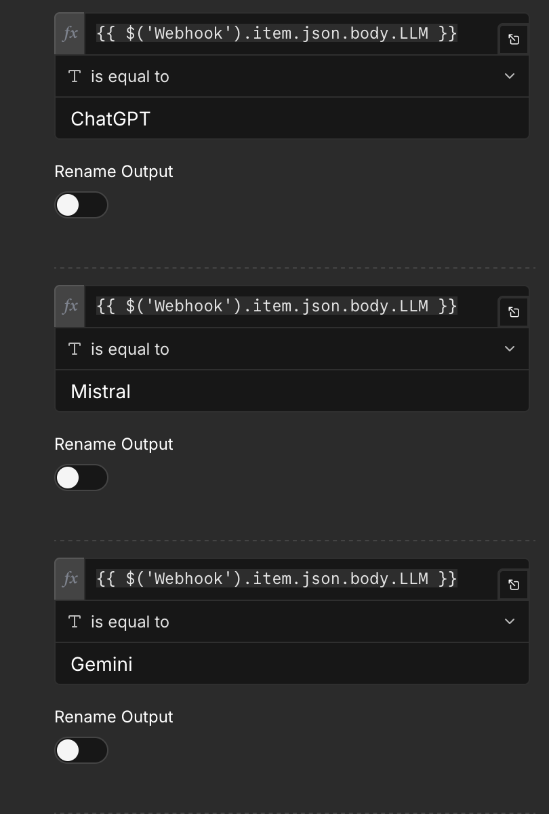

# Automatische Vereinfachung & Analyse der Texte

Im Rahmen meiner Bachelorarbeit wurden verschiedene Modelle über unterschiedliche Prompts und Eingabetexte getestet. Hierzu wurde eine Pipeline mittels n8n erstellt, welche die Vereinfachung sowie Auswertung der Texte automatisiert. Es folgt eine Anleitung zum Aufsetzen sowie Durchführen, für eigene Tests.

## Architektur

Der Aufbau der Pipeline folgt folgender Architektur:


## Voraussetzungen

- Python 3.14.2
- Node.js
- n8n
- API-Keys
- Docker (falls n8n self-hosted)

## Python Setup

1. **In den Ordner wechseln**

```bash
cd generation
```

2. **Virtuelle Umgebung erstellen**

```bash
python3 -m venv venv
```

3. **Virtuelle Umgebung aktivieren**

   macOS/Linux:

```bash
source venv/bin/activate
```

Windows:

```bash
venv\Scripts\activate
```

4. **Abhängigkeiten installieren**

```bash
pip install -r requirements.txt
```

## n8n Setup

Es gibt zwei Optionen für das n8n Setup. Zum einen kann n8n direkt auf deren Servern genutzt werden, was allerdings Geld kostet. Eine kostenfreie Alternative ist die selbst gehostete Variante.

### Self-Hosted – Initialisierung

1. **Ordner wechseln**

```bash
cd n8n
```

2. **Docker starten**

```bash
docker compose up -d
```

n8n ist danach unter `http://localhost:5678` erreichbar.

3. **Lokales n8n-Konto erstellen**

   Beim ersten Aufruf verlangt n8n die Einrichtung eines Owner-Kontos. Das ist ein rein lokales Konto, keine Online-Anmeldung.

### Cloud

Sollte die Cloud-Version von n8n verwendet werden, ist die Produktionsdomain für den Workflow eine andere. Deshalb muss die neue Produktionsdomain die alte Domain im `main.py` unter `URL` ersetzen.

### Workflow laden

1. **New Workflow -> Import From File -> `workflow.json` aus dem Ordner `n8n` importieren**
2. **Credentials für die API angeben**
3. **Workflow über den Active-Schalter aktivieren**

## TypeScript-Server Setup

1. **Ordner wechseln**

```bash
cd readability-server
```

2. **Pakete installieren**

```bash
npm install
```

3. **Server starten**

```bash
npm run dev
```

Der Port sollte 3000 sein, ansonsten muss der Port innerhalb der n8n-Node „Text Analyse" angepasst werden.

## Verwenden

Nachdem alle drei oben beschriebenen Bereiche laufen und alle API-Keys hinzugefügt wurden, kann die Durchführung starten. Beachte hierbei, dass die Ollama-Modelle selbst gehostet werden müssen, wenn diese getestet werden sollen. Für die allgemeine Durchführung gibt es zudem verschiedene Parameter, die angepasst werden können, welche im Folgenden erklärt werden. Nachdem die Durchführung erfolgt ist, befinden sich die Daten für die ausgewerteten Texte im Ordner `generation/results`, welcher bei erfolgreicher Durchführung erstellt wird.

Um die Durchführung zu starten, muss lediglich die `main.py` ausgeführt werden.

---

### Anpassen

In der `main.py` können die Durchführungen angepasst werden. Hierbei kann ausgewählt werden, welche Kombinationen durchgeführt werden.

```python
#----------------------------------------------------------------------#
#                           HIER BEARBEITEN
#----------------------------------------------------------------------#
#-----------#
temperatur = "0.6"  # Temperatur pro Modell
runs = 3            # Anzahl der Wiederholungen pro Kombination
#-----------#

# Kombination auswählen
# Leer lassen -> Schleife iteriert über alle Einträge innerhalb des JSON
# Einfügen -> Es wird für die Kategorie nur der Eintrag beachtet
# Hinweis: Beim Einfügen eines Modells werden die LLM-Familien ignoriert,
# zu denen das Modell nicht gehört
SELECTED_PROMPTS = []   # z. B. ["Komplex"]
SELECTED_TEXTS = []     # z. B. ["Alltagstext"]
SELECTED_LLMS = []      # z. B. ["Claude"]
SELECTED_MODELS = []    # z. B. ["claude-opus-4-20250514"]
#-----------#
#----------------------------------------------------------------------#
```

Die SELECTED-Listen iterieren, wenn sie leer sind, über alle Prompts, Eingabetexte sowie Modelle, die sich in der config befinden. Fügt man Einträge zu den Listen hinzu, wird für diese Kategorie nur über die Attribute in der Liste iteriert.

---

### Erweitern

Um neue Eingabetexte, Prompts oder Modelle hinzuzufügen, müssen diese zur config hinzugefügt werden. Zusätzlich dazu muss, wenn es sich um einen neuen Modellanbieter handelt, dieser zu n8n hinzugefügt werden. Hierfür muss eine neue Node sowie ein Eintrag in den Switch erfolgen, dessen Ausgabe mit der neuen Node verbunden wird, analog zu den bereits vorhandenen Nodes. Der neue Switch-Eintrag muss folgendem Schema folgen:



Wenn sich der neue Modellfamilienname in der config nun mit dem Eintrag im Switch deckt und der daraus resultierende Pfad zur korrekten API-Node führt, sollten die neuen Modelle funktionieren.
